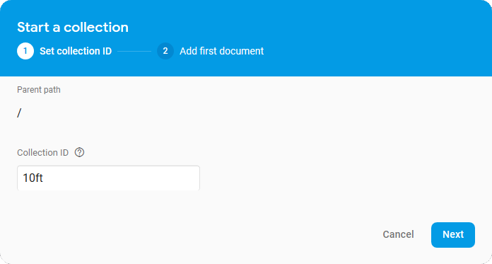

# Setup

## Step 1: Set up requirements

Trumpet requires [Python 3](https://python.org) and [Flask](http://flask.pocoo.org/) to be installed on a computer that will be on for the duration of your event. You can download Python 3 from [python.org](https://www.python.org/downloads/) - when you do make sure that you also install pip. Once that's finished, in a terminal run the command (may require `sudo`, or appending `--user` to the command):

```bash
$ pip install Flask
```

## Step 2: Clone the repo

Navigate to the location you would like to save Trumpet to, and run the command:

```bash
$ git clone https://github.com/HackSocNotts/trumpet.git
```

## Step 3: Set up the configuration file

Navigate to the trumpet folder that was just created, and open `misc/config.json` in a text editor of your choice. For now, ignore the firebase configuration details, and fill in the rest of the file:

| Name             | Description                                                                           |
|------------------|---------------------------------------------------------------------------------------|
| terminalPass     | The password that must be entered to access the 10ft display or terminal page         |
| hackathonStart   | An ISO 8601 date string representing the start of the hacking duration of the event   |
| hackathonEnd     | An ISO 8601 date string representing the end of the hacking duration of the event     |
| eventName        | The name to show at the top of the current time/time remaining screen                 |
| eventEndInfo     | HTML formatted information to show after the hacking duration of the event has ended  |
| mainBackground   | The colour of the background of the current time/time remaining screen                |
| alertBackground  | The colour of the background of alerts that appear on the screen                      |
| mainTextColour   | The colour of text on the current time/time remaining screen                          |
| alertTextColour  | The colour of text on the alerts that appear on the screen (though not in tweets)     |
| progressBarLeft  | The colour of the left part of the progress bar (grows right as the event goes on)    |
| progressBarRight | The colour of the right part of the progress bar (shrinks right as the event goes on) |

## Step 4: Set up Firebase

Trumpet uses Firebase in order to quickly distribute information from a terminal page to all screens at an event. In order to set it up to be used, go to [https://console.firebase.google.com](https://console.firebase.google.com) and click "Add project". Enter a name ("yourhackathonsname-trumpet" is probably a good idea) and click continue (it's up to you what you use for the Google Analytics sharing settings).

When that's finished being created, click on "Database" on the sidebar on the left side of the screen. Click "Create database" and in the pop-up that appears, click "Start in **test mode**" followed by "Enable".

Next, navigate to the "Authentication" tab on the sidebar, at the top of the list. On the top right of the screen, click "Web setup" and copy the values for "apiKey" and "projectID" from the config object in the pop-up that appears into `misc/config.json` (in place of `ENTER_API_KEY_HERE` and `ENTER_PROJECT_ID_HERE`).



## Step 5: Run and connect to the server

Now, run the `server.py` file. The exact command may vary depending on your operating system, so if in doubt, look up how to run Python 3 files on your setup. Then, navigate to `http://localhost:5000` from a browser. If everything is working, this will show an index page with links labelled "10ft" and "Terminal". "10ft" is the page designed to be shown on screens around the event, and "Terminal" is the page that allows you ot send messages, gifs, tweets, or whatever other HTML you'd like to show to all at the event.

At each computer you'd like to show the 10ft display page, navigate to your computer's IP address (with port 5000), click "10ft" and enter the password you set in step 3. Then, if you'd like to send a message during the event, open the terminal page on another computer and enter your password. Then select the appropriate type for the message, the duration in seconds you'd like the message to appear for, and click "Submit Modal". The types of messages are as follows:

| Type  | Description                                                                              |
|-------|------------------------------------------------------------------------------------------|
| Text  | Either plaintext, or html                                                                |
| Image | The url for an image (can be of any type a browser can display, such as png, jpg or gif) |
| Tweet | Thr url to a tweet, such as https://twitter.com/jack/status/20                           |
